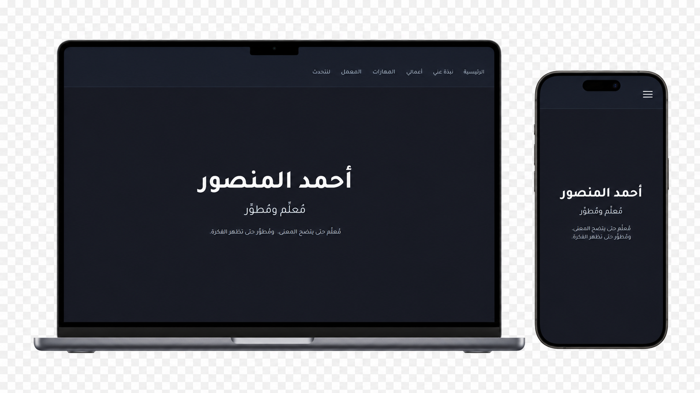
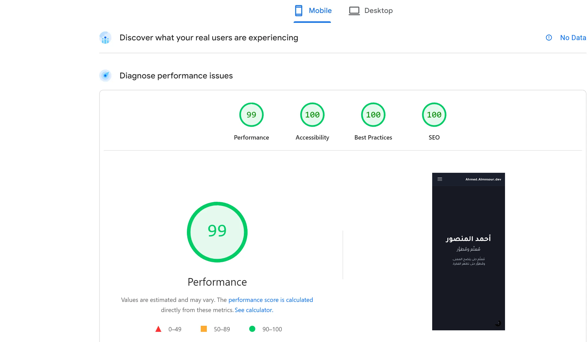

# 📱 موقع أحمد المنصور الشخصي (Portfolio Website)

هنا متنفسي، حيث يلتقي الكود بالكلمة. مقالات تقنية، تحديات، وتجارب من الميدان.

🔗 **رابط الموقع المباشر:** [ahmed.almnsour.net](https://ahmed.almnsour.net/)

<p align="center">
  
</p>

---

## 📊 الأداء

100 ديسكتوب · 99 جوال — مقاس بـ Google PageSpeed Insights.



---

## 🛠️ التقنيات المستخدمة

* **TypeScript**: للأمان النوعي، والتطوير الأسرع.
* **Next.js 16** (App Router): SSR/SSG للأداء والـ SEO.
* **CSS Modules**: بعيداً عن المكتبات، من أجل التحكم الكامل بالتصميم.
* **Vercel**: النشر التلقائي بواسطة GitHub، ووقت استجابة سريع.

---

## 🚀 تشغيل المشروع محليًا

1. **نسخ المستودع:**
   ```bash
   git clone https://github.com/ahmedalmnsour/ahmed-almnsour-dev.git
    ```
2.  **الدخول للمجلد:**
    ```bash
    cd ahmed-almnsour-dev
    ```
3.  **تثبيت المكتبات:**
    ```bash
    npm install
    ```
4.  **تشغيل خادم التطوير:**
    ```bash
    npm run dev
    ```
5.  افتح [http://localhost:3000](http://localhost:3000) في متصفحك.

---

## 💬 تواصل معي

- 📧 البريد الإلكتروني: [almnsour.ahmed@gmail.com](mailto:almnsour.ahmed@gmail.com)
- 📱 واتساب: [تحدث معي](https://wa.me/96597311821)
- 💼 LinkedIn: [أحمد المنصور](https://www.linkedin.com/in/ahmedalmnsour/)

---

> تم إعادة بناء الموقع بالكامل في مايو 2026.
